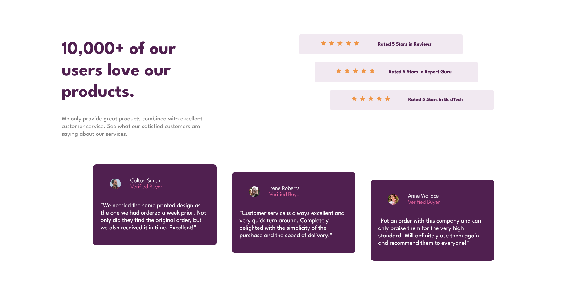

# Frontend Mentor - Social proof section solution

This is a solution to the [Social proof section challenge on Frontend Mentor](https://www.frontendmentor.io/challenges/social-proof-section-6e0qTv_bA). Frontend Mentor challenges help you improve your coding skills by building realistic projects. 

## Overview

### The challenge

Users should be able to:

- View the optimal layout for the section depending on their device's screen size

### Screenshot

### Links

- Solution URL: https://github.com/eftpmc/social-proof
- Live Site URL: https://social-proof-eftpmc.vercel.app/

## My process

### Built with

- Semantic HTML5 markup
- CSS custom properties
- Flexbox
- CSS Grid
- [React](https://reactjs.org/) - JS library
- [Next.js](https://nextjs.org/) - React framework

### What I learned

During this challenge, I learned and worked with grids and flexboxes. I worked with these displays and learned how to make websites optimized for phones as well. Once the size of the screen reaches a certain width, it switches all the text and elements on the page making it optimal for phone users. I also learned how to make offsets and how to create visual interest on a page. 
